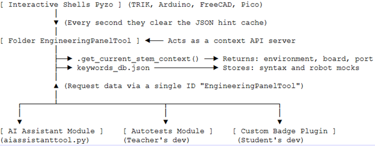

# pyzo-engineering
Programming tools for FreeCAD, Raspberry Pi, Raspberry Pi Pico, Arduino, and TRIK controllers based on the Pyzo development environment
The environment uses the  Python interpreter  , as well as the PySide6 library from the portable  FreeCAD build  . 

What has been done and is working:

1. The graphical 'Engineering Control Panel ' integrates seamlessly with Pyzo . It includes preconfigured interfaces for programming the TRIK controller,  FreeCAD , and the Raspberry Pi single-board computer. Pi , Raspberry Pi controllers Pi Pico and Arduino  . 

2. Using  ArduinoCLI  , sketches are compiled and uploaded.  The Arduino board firmware is successfully loaded, and automatic detection and display of boards uploaded to the Arduino CLI is working. 

3. Using the  pyserial library, the COM port  operates in text and graphical modes, with automatic port number  detection and data flow rate selection. 

4. Automatic code highlighting and  automatic error color highlighting are available. 

5. Autocompletion works .

6. The Shell window displays help  text for keywords and warnings with tips if keywords are misspelled. 

7. The Engineering  Panel Tool module provides system data upon request from external programs in accordance with the following format: 

```
SYNCHRONOUS RESPONSE FORMAT OF THE get_current_stem_context ( ) -> dict METHOD :
{
" environment ": "String ", # Active engineering development environment.
#  Options  : " arduino ", " freecad ", " trik ", " pico ", "pi", "unknown" 
" board ": "String ", # Human-readable name of the selected hardware board.
# Applicable to " Arduino ". If the environment is different, use " Unknown ".
" port ": "String" # Active COM port identifier (e.g. "COM4").
# Applicable to " arduino " and " trik ". If not found - "Not connected"
}
```

8. Using this  API  and a local installation of the  Ollama server with the qwen2.5 library, a  Pyzo-  embedded  AI  Assistant  Tool  module was created  that takes into account the syntax specifics for each of the shells. 

Structure of the Pyzo engineering add-on:



The package is built using the suggested folder structure.  Pyzo  is installed as a  Python interpreter module.  FreeCAD with the  python -m pyzo  command  in the  FreeCAD \ bin folder  . A  pyserial folder  with  COM  port libraries is created in  PyzoSource  \  internal  \  pyzo  \  tools  \  EngineeringPanelTool 

Setting up relative paths of system components is done using a  bat  file in the root folder. 
